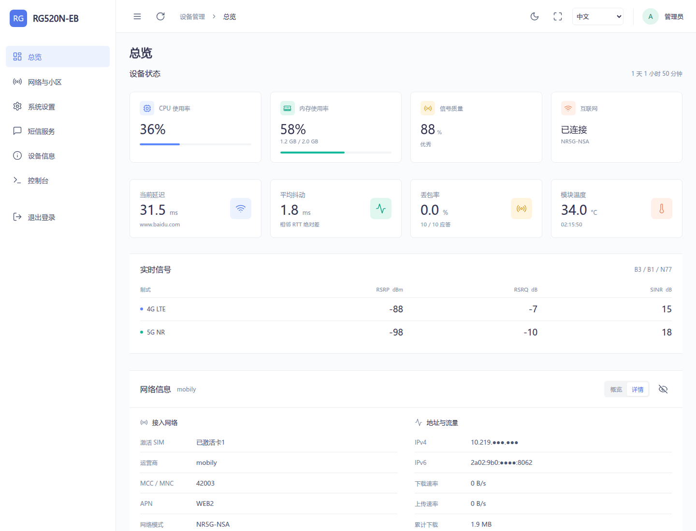
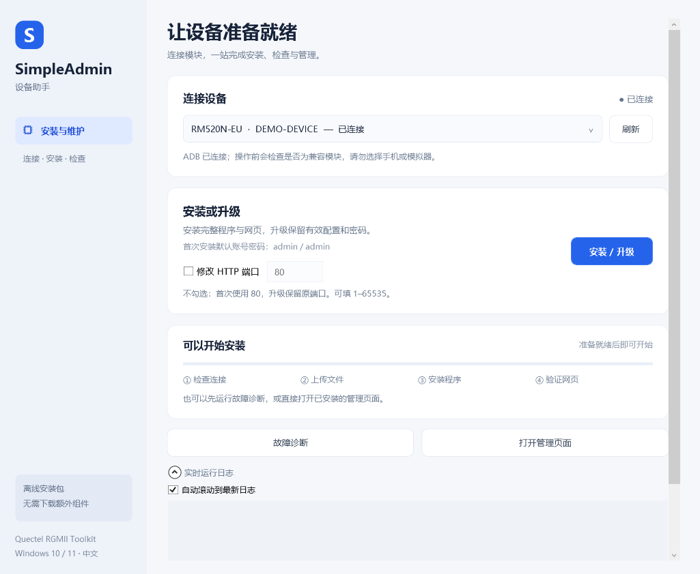
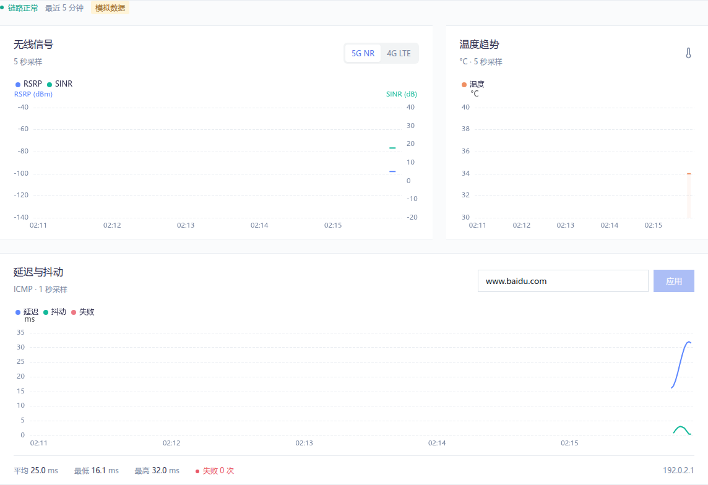
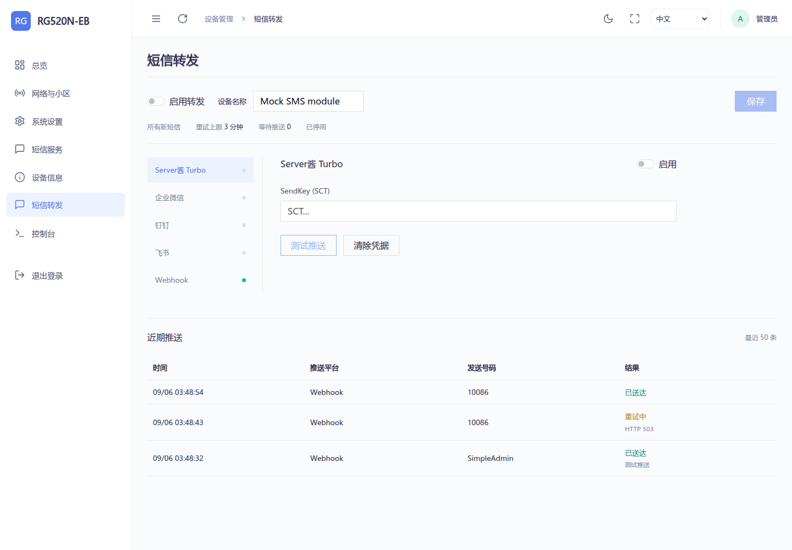
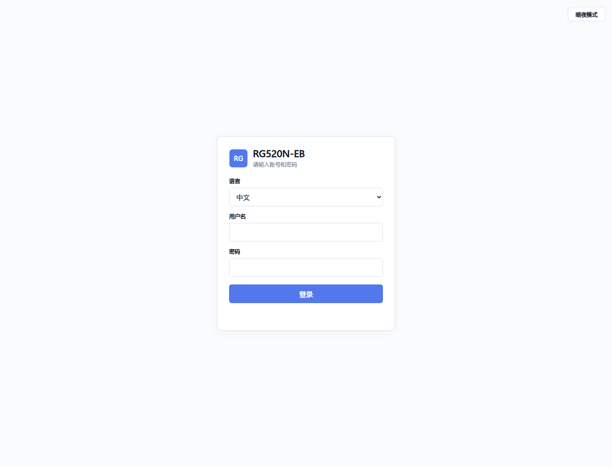
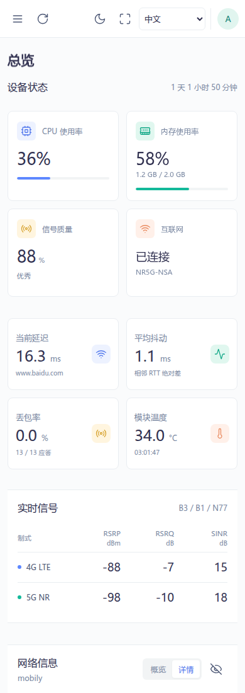
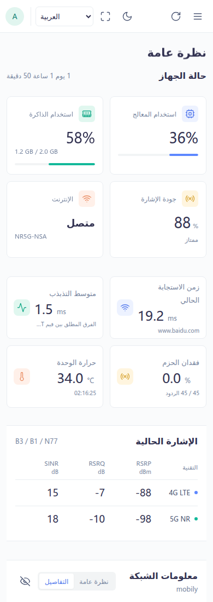

# Quectel RGMII Toolkit · Rust

面向移远 RM520N-EU 的轻量设备管理后台。Rust 原生后端，保留 Go 版的页面、AT 操作和安装方式，支持中文、English、Русский、العربية。

[下载离线安装包](https://github.com/tcpqueue/quectel-rgmii-toolkit-Rust/releases/latest) · [功能核对与真机测试](docs/validation.md) · [构建说明](docs/build.md) · [Go 原项目](https://github.com/snjzb/quectel-rgmii-toolkit-Go)



> 截图使用模拟数据。已在 RM520N-EU 真机安装测试，其他型号和固件尚未完成实机验证。

## 安装

1. 下载单文件 `SimpleAdmin-Setup.exe`；若下载 `offline.zip`，解压后也只有这一个 EXE。
2. 将模块连接到 Windows 电脑。EXE 已内嵌 ADB、设备程序、网页和安装资源，无需另附文件夹或联网下载依赖。
3. 双击 **`SimpleAdmin-Setup.exe`** 打开中文设备助手，选择模块，点击 **安装 / 升级**。等待文件校验、服务和 HTTP 页面检查通过。
   下方实时日志默认展开，逐行显示执行时间和输出；取消“自动滚动到最新日志”即可查看前面的记录。
4. 浏览器访问模块地址，通常为 `http://192.168.225.1`。首次打开先选择语言，再使用 `admin / admin` 登录。

也可以通过 ADB 转发访问：

```powershell
.\adb.exe forward tcp:18081 tcp:80
```

随后打开 `http://127.0.0.1:18081`。



设备助手采用 WinUI 风格的中文界面，支持自动检测、多设备选择、分步进度、故障诊断、打开管理页面和查看报告。基于 Windows 10/11 的 .NET Framework/WPF，无需另外安装 WinUI 运行库；截图使用模拟设备。

点击 **打开管理页面** 会检查登录页，并通过自动分配的空闲 ADB 转发端口打开浏览器。ADB 通道能打开页面，只证明应用可用；通过模块 IP 访问还取决于网卡、路由与固件防火墙。保持 USB 连接即可使用该通道。

对外部署只需发送 EXE。内部安装资源运行时解压到 Windows 临时目录，退出时尽量清理；被共享 ADB 服务占用的文件保留到系统清理临时目录，不强制关闭 ADB。图形操作报告保存在 `%LOCALAPPDATA%/SimpleAdmin/Reports`，可点击“查看报告”。安装过程中请保持 USB 连接，不要断电。

**安装后打不开网页：** 在设备助手中点击“故障诊断”，然后“查看报告”。也可诊断旧版本，不重新安装、不重启、不执行 AT 指令、不读取短信或密码。报告包含设备序列号和网络地址，分享前可自行遮盖。参见 [安装排查](docs/install-troubleshooting.md)。

默认安装会读取当前 bridge0 MAC，并保存到固件支持的 QCMAP 配置，让下次启动沿用当前地址。不会生成新 MAC、切换当前地址、重启 QCMAP 或要求重启设备；相同配置不重复写入。读取失败或固件字段不支持时会显示警告并跳过。维护时可设置 `SIMPLEADMIN_FIX_BRIDGE0_MAC=0` 禁用此步骤。

**升级已有 Go 版：** 直接运行安装工具。脚本停止旧进程、替换程序和页面，保留有效的 Web 登录凭据、TTL、监测目标和 root 密码初始化标记；无需先卸载。首次安装将系统 root 密码初始化为 `admin`，已有初始化标记时不重置密码。

**修改密码：** 登录后进入系统设置，可分别修改 Web 登录密码和系统 root 密码，需要验证当前密码。修改后现有会话失效，重新登录即可。两种密码独立保存。

**升级：** 直接使用设备助手“安装 / 升级”，无需先卸载。卸载维护脚本保留在源码中，不作为单文件安装器的对外附件。

## 功能

| 页面 | 内容 |
| --- | --- |
| 总览 | CPU、内存、网络状态、流量、频段、小区、信号和天线读数 |
| 网络与小区 | APN、网络模式、频段选择、LTE/NR 小区扫描、手动及扫描结果锁小区 |
| 系统设置 | Web/root 密码、TTL、IP 透传、DNS 代理、USB 网络模式、DMZ、LAN IP、AT 终端 |
| 短信 | 收件箱、长短信合并、分段发送、号码国家代码补全、批量删除 |
| 短信转发 | Server酱 Turbo、企业微信、钉钉、飞书、Webhook；去重、失败重试、推送结果 |
| 设备信息 | 型号、版本、SIM 和设备标识等信息 |
| 控制台 | 使用系统 root 密码认证的原生 PTY 终端 |

UI 延续 Art Design Pro 的布局和配色，静态资源本地提供，支持明暗主题、移动端和阿拉伯语从右到左布局。总览把主要信息放在上方，趋势图放在下方；读不到 4G 数据时隐藏相关读数与图例，SINR 为 0 的有效数据正常显示。

## 五分钟趋势



| 数据 | 周期 | 保留量 | 存储 |
| --- | --- | --- | --- |
| Ping RTT / Jitter | 1 秒 | 最近 5 分钟，最多 300 点 | 内存 |
| RSRP / SINR / 温度 | 5 秒 | 最近 5 分钟，最多 60 点 | 内存 |
| 下载 / 上传速率与流量占比 | 5 秒 | 最近 5 分钟，最多 60 点 | 内存 |

- 默认 Ping `www.baidu.com`，可改为域名、IPv4 或 IPv6 地址。
- 采集由设备后台运行，关闭网页后继续；重启程序后历史清空。
- RSRP 与 SINR 共用图表，分别使用左右坐标轴。温度单独绘图。
- 下载与上传共用双折线图，按实际 AT 采样间隔计算速率，重复缓存不产生虚假的零速率。占比按近五分钟有效采样区间的上下行字节数计算；无流量时显示空占比。
- 单点 Jitter 为 `abs(RTT[n] - RTT[n-1])`，平均抖动为窗口内有效差值的算术平均。丢包、采样间断和窗口外的数据不参与跨点配对。
- DNS 解析失败与 ICMP 超时分别记录。Ping 结果表示目标的 ICMP 可达性。

## 短信转发



短信页提供功能总开关，以及默认关闭的“全部渠道转发成功 24 小时后自动删除”。关闭短信功能会停止应用的短信轮询、发送操作及转发，SIM 卡仍可接收运营商短信。

在“短信转发”中填写设备名称和推送凭据，可同时启用多个平台。Server酱使用 Turbo 的 SCT SendKey；企业微信、钉钉和飞书使用群机器人 Webhook，钉钉、飞书支持签名密钥。

- 推送包含发送号码、完整正文、接收时间和设备名称，长短信等待分段齐全。
- 每 10 秒检查新短信，关闭网页后继续。启动或重新启用时，已有短信不补发。
- 失败任务最多保留 3 分钟，队列和最近 50 条结果仅在内存中，重启后未完成任务不补发。
- 可选自动删除以所有启用渠道确认成功的时间起算，至少等待 24 小时。删除凭据只保存存储位置、指纹与时间，按分钟合并写入；位置被复用时取消任务。为防止设备从 1970 年校时后提前删除，额外要求完整的 24 小时单调计时；重启程序或系统时间异常会重新等待至少 24 小时，不触发短信重发。

配置步骤、Webhook 格式和存储边界见 [短信功能说明](docs/sms.md)。截图为模拟数据。

## 资源与存储

后端使用单线程异步运行时、一个 AT 工作线程及一个串口读取线程，直接访问 `/dev/smd11`，不再启动 Go SMD 辅助进程或 `socat`。请求串行执行，短信的提示符、PDU 和结束响应属于同一事务。

历史数据采用固定长度环形数组和定点数，三类历史的原始数组合计不超过 **8,160 字节**。AT 队列最多 16 个请求，缓存最多 64 项、响应内容合计最多 1 MiB，会话与 WebSocket 也有数量限制。这些是内部缓冲区上限，不代表程序总内存占用。

持久化设置统一执行 **根目录 rw → 写临时文件 → 同步 → 原子替换 → 根目录 ro**。内容不变时跳过写入；曲线、会话、锁文件均留在内存或 tmpfs。服务仅在 `/tmp` 为 tmpfs 时保留当次启动消息或退出错误，每次启动覆盖，不输出持续日志；控制台不写 shell 历史。应用目录及可执行文件权限为 `777`，认证文件为 `600`。

v0.1.0 在 RM520N-EU 同条件后台采样中，CPU 约 **1.46% → 0.45%**，PSS 内存约 **7.25 MiB → 1.40 MiB**；正常页面访问场景下 Rust 约 **3.1 MiB**。ARM 程序从 7.93 MB 缩小到约 4.15 MB。历史基线的采样条件与适用范围见 [验证记录](docs/validation.md)。

短信转发默认关闭，HTTP 客户端在首次推送时初始化。只有启用自动删除后，已确认转发的短信才额外保存删除凭据；未启用时不为每条转发写入文件。

Ping 和短信转发的 DNS 查询分别限制为最多一个，独立于网页文件读取线程；离线或 DNS 卡住时后台仍可访问。图表首次获取五分钟全量数据，随后只传新增采样；非监测页面的 AT 缓存超过两分钟无人访问时停止主动刷新，重新访问会恢复。普通 HTTP 同时最多 32 条连接，API WebSocket 最多 8 条、终端最多 2 条，并限制慢请求与单条消息大小。

## 界面与语言



| 中文移动端 | العربية |
| --- | --- |
|  |  |

语言选择保存在当前浏览器中，不因切换语言反复写入模块存储。旧版语言 API 仍保留兼容。

## Windows 预览

双击 `windows-test/start.bat`，打开 `http://127.0.0.1:8080`，默认 `admin / admin`。该模式使用模拟 AT 和监测数据，便于预览页面；不能代替模块硬件测试。

## 开发

源码、锁定依赖、ARMv7 静态可执行文件及 Windows 预览程序均随仓库提供。编译与打包步骤见 [docs/build.md](docs/build.md)。WSL 中请在 Linux 原生目录构建，例如 `~/projects/`；`/mnt/...` 只用于传输文件。

## 来源与许可

基于 [snjzb/quectel-rgmii-toolkit-Go](https://github.com/snjzb/quectel-rgmii-toolkit-Go) 的功能和前端迁移，保留原项目 MIT 许可与署名。界面参考 [Art Design Pro](https://github.com/Daymychen/art-design-pro)，图表和图标使用 ECharts、Lucide。相关前端许可位于 `development/simpleadmin/www/licenses/`。Rust 依赖版本见 `Cargo.lock`。
