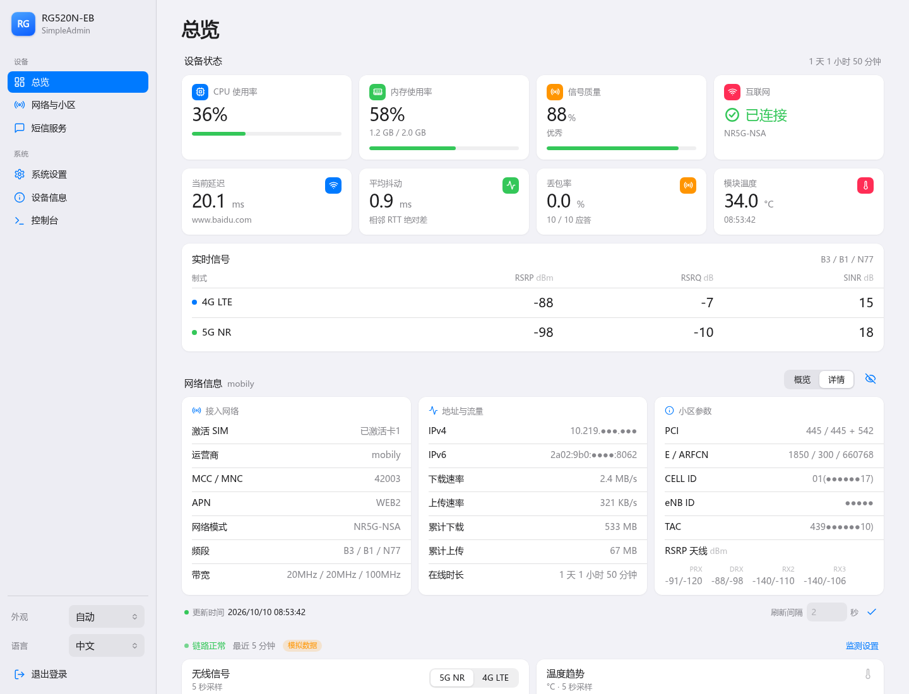
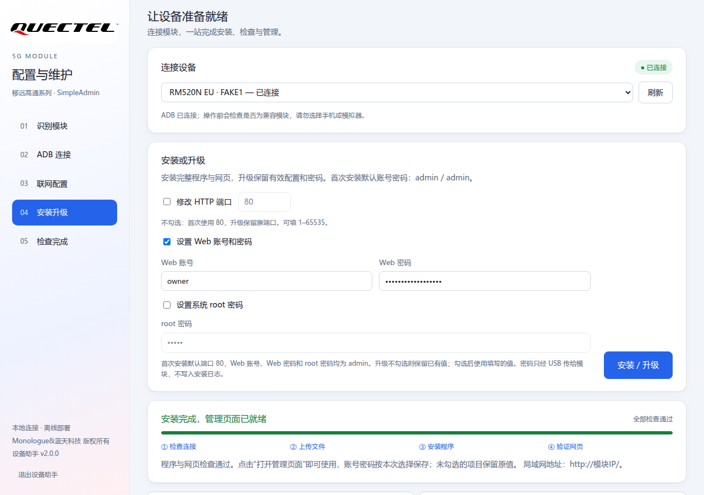
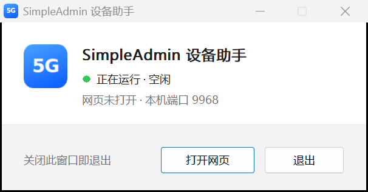
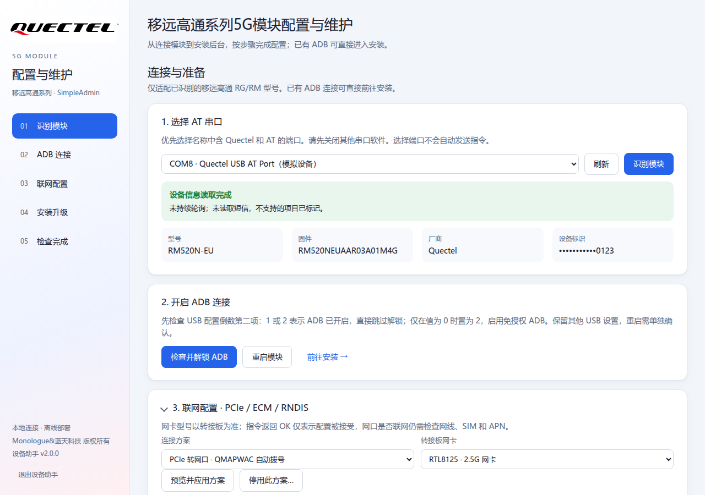
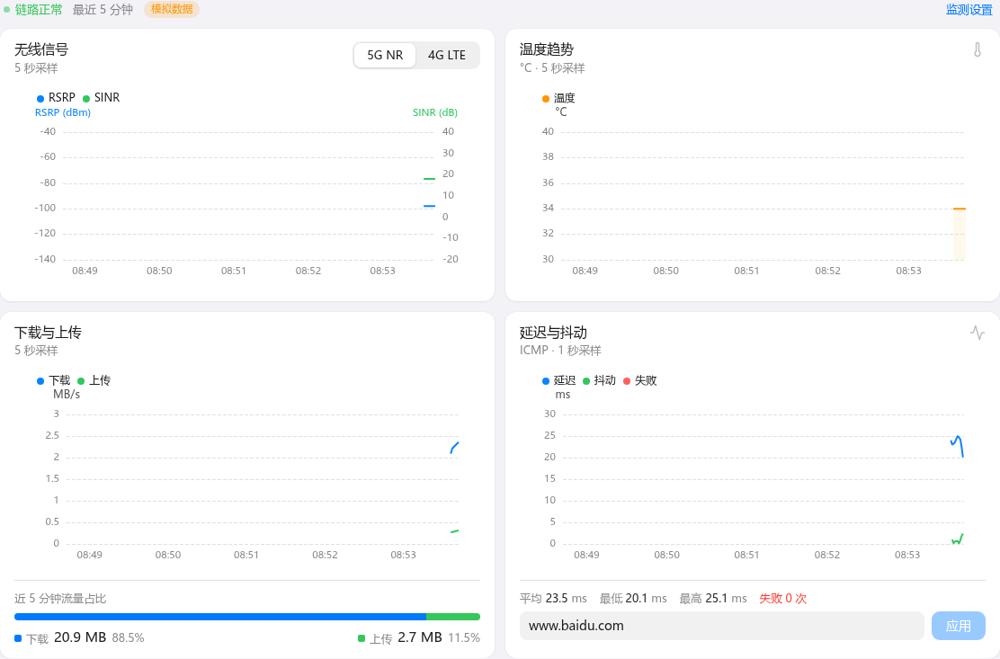
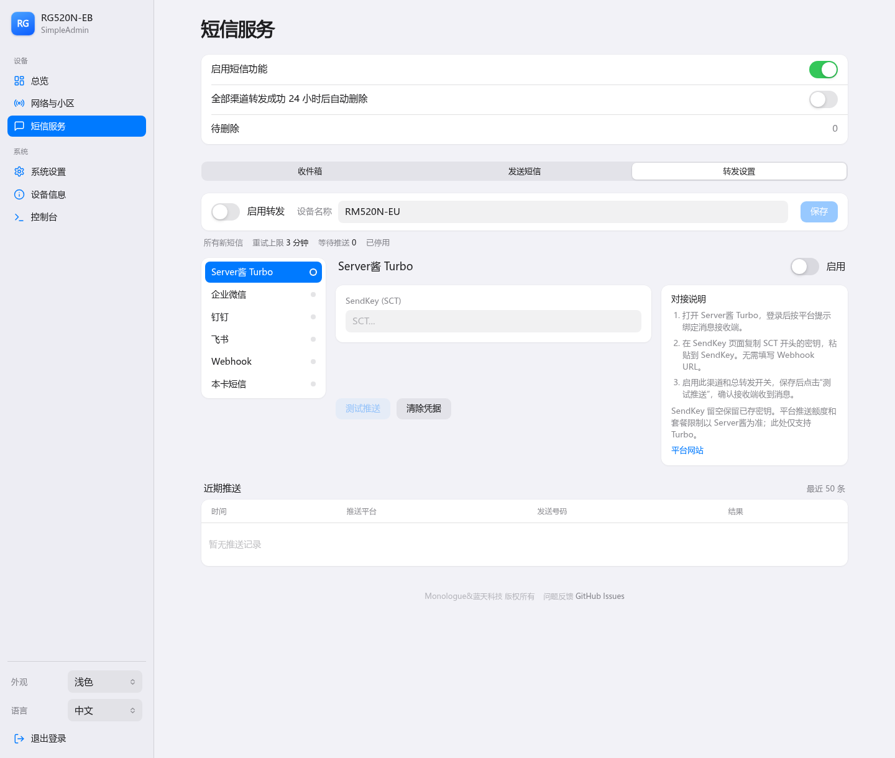
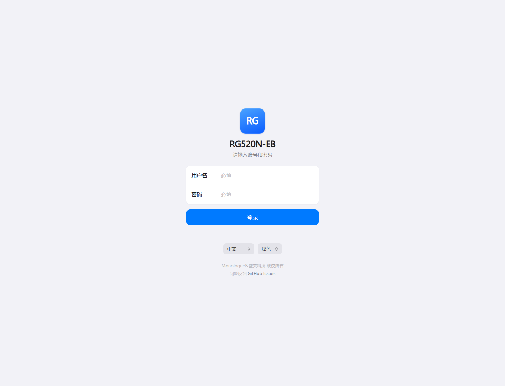
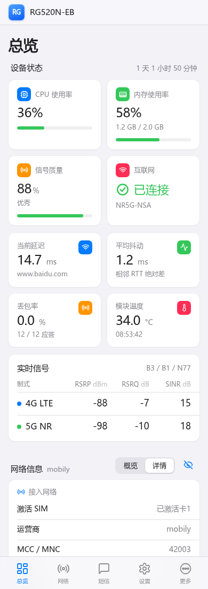
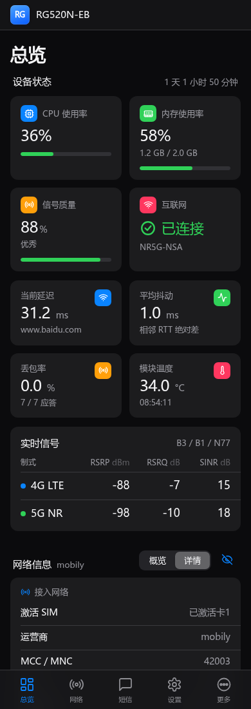
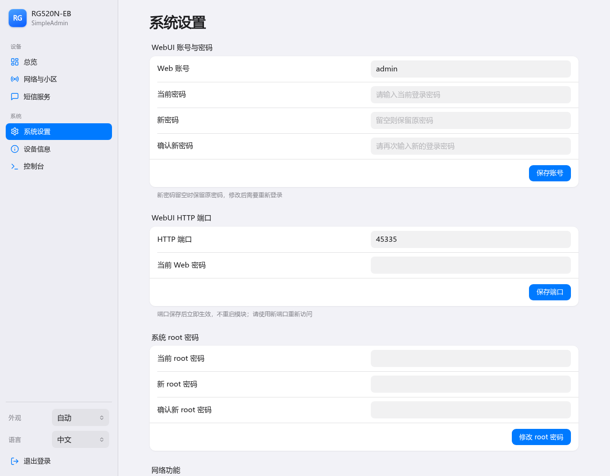

# Quectel RGMII Toolkit · Rust

面向移远 RM520N-EU 的轻量设备管理后台。Rust 原生后端，保留 Go 版的页面、AT 操作和安装方式，支持中文和 English。

[下载离线安装包](https://github.com/tcpqueue/quectel-rgmii-toolkit-Rust/releases/latest) · [功能核对与真机测试](docs/validation.md) · [构建说明](docs/build.md) · [Go 原项目](https://github.com/snjzb/quectel-rgmii-toolkit-Go)



> 截图使用模拟数据。已在 RM520N-EU 真机安装测试，其他型号和固件尚未完成实机验证。

**v0.2.7 修复：** 修复 NR5G 扫描结果首次无法选中、相同 PCI 的小区参数混用和旧选择残留；纠正上传、下载流量方向，累计流量、速率与五分钟趋势同步修正。参见 [流量统计说明](docs/traffic.md)。

**v0.4.6 锁定状态与邻区扫描：** 小区锁定直接显示模块当前的锁定，并区分“临时锁定 · 重启后失效”和“持久锁定 · 重启后自动恢复”，列出频点、PCI、频段和 SCS，两种锁定都可直接解锁；锁定按钮写明临时或持久，频段锁定注明由模块自动保存。扫描新增约 1 秒的邻区扫描（服务小区和 LTE 邻区），与完整扫描并存；完整扫描中多家运营商共享的小区（如电信/联通）合并为一行，结果可以直接点选锁定，扫描等待上限提高到 180 秒。PDP 激活改为开关，网络功能开关改为高亮当前选项的分段按钮和开关。参见 [锁定状态与扫描](docs/sms-cell-lock.md#锁定状态与扫描v046)。

**v0.4.5 PDP 管理与网络开关：** “网络与小区”新增 PDP 上下文管理：列出全部上下文及其地址和激活状态，可新增、编辑、删除、激活、去激活；去激活正在上网的连接前会先确认。新增网络功能开关：IMS/VoLTE（跟随 MBN、强制开启、强制关闭）、SIM 热插拔检测、数据漫游、SIM 卡槽切换。在线更新默认通过 `https://ghfast.top/` 代理访问 GitHub（清空即直连；已保存过更新设置的模块保留原设置），检查失败后约 1 小时重试（以前要等 24 小时）；安装失败且网页服务已停止时会自动重新启动服务。

**v0.4.4 按 AT 手册校正：** 对照 RM5x0N AT 手册逐条核对模块发送的指令。LTE SINR 按手册换算为 dB（读数 ×2−20），以前显示偏高；只连 LTE 时频点不再误显示为频段号；识别 200/400/35/45 MHz 的 NR 带宽；天线 RSRP 为 -32768（无效）时显示 “-”；关闭 DMZ 补上手册要求的 IP 类型参数；开启 IP 透传的等待时间延长到 10 秒；DNS 代理和 LAN IP 保存后提示重启模块才生效。

**v0.4.3 NR5G 锁定修复：** 锁定 5G 小区前先查询模块当前运营商配置（MBN）允许的 SA 频段，频段不在其中时直接提示原因，不再只显示 `+CME ERROR: 902`；例如移动配置下 SA 频段只有 n28、n41，无法锁定电信/联通的 n78 小区。扫描锁定改用扫描结果中的子载波间隔（SCS），不再固定为 30 kHz，并拒绝与频段不匹配的 SCS。锁定和解锁等待时间延长到 10 秒，真机约需 1.3 秒，以前会误报超时；未锁定时解锁不再报错。参见 [短信与小区锁定](docs/sms-cell-lock.md#nr5g-sa-锁定检查)。

**v0.4.2 恢复根目录挂载：** v0.4.1 写 `/usrdata` 时不再挂载根目录，在模块上会导致设置保存失败。本版恢复为：除 `/tmp` 外，写任何位置都先把根目录挂成读写，写完挂回只读。v0.4.1 中的另外两项修复保留：
- 损坏的转发或锁小区设置文件，下一次保存时会重写。
- 开机恢复 TTL 失败时改为后台重试，不影响网页服务启动。

请从 v0.4.0 或 v0.4.1 在线更新到本版。

**v0.4.0 在线更新：** 系统设置新增“在线更新”。模块可以直接从 GitHub 检查并安装新版本，可选关闭、每天检查或每天自动安装。更新源可以改为其他仓库或自建网址，也支持 GitHub 代理。安装包必须带有效签名，只会升级不会降级，账号密码和端口保持不变。从 v0.3.1 及更早版本升级时，需要先用设备助手装一次 v0.4.0。参见 [在线更新说明](docs/ota.md)。

**v0.3.1 审查修复：** 模块服务重启、会话超时或在其他地方修改密码后，已打开的页面会回到登录页，不再只是静默报错。登录页在尝试过多时提示需要等待的秒数，登录后的跳转只接受本站地址。设置页“网络功能”（IP 透传、USB 协议、DMZ、LAN IP、DNS 代理）和 TTL 会显示保存结果与输入错误，失败时保留已填内容，USB 协议只在模块接受后才提示重启。浏览器标签标题随界面语言切换，浏览器后退只切换一次页面，补全若干英文提示，短信时间按“年/月/日”解析。后端：并发登录不能再绕过失败退避（网页终端 root 登录同样排队）；连接数耗尽等临时错误不再让网页服务退出；语言接口只接受中文和英文。设备助手仍为 2.1.0，内置本版模块程序。

**v0.3.0 管理后台新界面：** 模块网页改为苹果风格设计：电脑上使用侧边栏，手机上使用底部标签栏；各页面改为分组列表，开关、分段控件和弹出面板与系统一致；外观可选自动、浅色或深色。网络页的频段锁定改为可点选的频段标签，扫描与手动锁定分开；设置页按账号、端口、网络功能、偏好与维护分组。移除 Bootstrap 和 Poppins 字体，网页资源减少约 480 KB。界面语言精简为中文和英文。

**v0.2.9 设备助手界面更新：** 设备助手（安装器 2.1.0）改为侧边栏分页的新界面：已连接 ADB 时直接进入安装，否则从连接模块开始；安装选项改为开关，进度按步骤显示。运行时显示一个小状态窗口，可随时打开网页或退出，不再在后台隐形运行。模块端程序与 v0.2.8 相同。

**v0.2.8 安全与资源更新：** 修改设置的接口只接受同站 POST，防止外部网页借登录状态执行 AT 指令；登录、改密和网页终端的密码错误按客户端退避限速；Web 密码改为加盐哈希保存，升级后首次启动自动转换。总览的延迟监测与信号/流量采样可分别关闭或调整间隔；短信转发在确认收到新短信通知后改为 60 秒兜底轮询；扫描小区等慢请求不再阻塞同一页面的其他请求。详见 [安全与资源说明](docs/security.md)。升级后如需回退到 v0.2.7 及更早版本，请先在安装器中重新设置 Web 密码。

**v0.2.6 短信更新：** 对齐 VoHive 的 AT 短信编码与发送握手，支持短号码、GSM-7/UCS2 自动编码、ME/SM 收件箱和新短信通知。此版本短信收发仅做离线及模拟串口验证，没有进行真实短信发送。参见 [短信兼容性与验证范围](docs/sms-compatibility.md)。

## 安装

1. 下载单文件 `SimpleAdmin-Setup.exe`；若下载 `offline.zip`，解压后也只有这一个 EXE。
2. 将模块连接到 Windows 电脑。EXE 已内嵌 ADB、设备程序、网页和安装资源，无需另附文件夹或联网下载依赖。
3. 双击 **`SimpleAdmin-Setup.exe`**，默认浏览器会自动打开“移远高通系列5G模块配置与维护”页面。选择模块，点击 **安装 / 升级**。等待文件校验、服务和 HTTP 页面检查通过。
   如需自定义端口，先勾选“修改 HTTP 端口”，填写 `1–65535` 的端口，例如 `8080`。不勾选时，首次安装使用 `80`，升级保留原端口。
   下方实时日志默认展开，逐行显示执行时间和输出；取消“自动滚动到最新日志”即可查看前面的记录。
4. 浏览器访问模块地址，通常为 `http://192.168.225.1`。首次打开先选择语言，再使用 `admin / admin` 登录。
   自定义为 `8080` 时，访问 `http://192.168.225.1:8080/`。设备助手的“打开管理页面”和“故障诊断”会自动读取已保存的端口。

也可以通过 ADB 转发访问：

```powershell
.\adb.exe forward tcp:18081 tcp:80
```

随后打开 `http://127.0.0.1:18081`。
若模块使用自定义端口，请将命令右侧的 `tcp:80` 改为对应端口，例如 `tcp:8080`；左侧是电脑本地端口。

端口保存在模块 `/usrdata/simpleadmin/http_port`，安装时先将根目录挂载为读写，写入完成后恢复只读。相同值不重复写入；开机仅读取配置。修改端口后自动重启应用，无需重启模块。新端口已被占用时，安装器会在停止原服务前报错。
若固件已有针对 `rmnet*` 接口的 TCP 80 DROP 规则，启动时会对自定义端口添加同样的限制，并置于放行规则之前，保留这项移动网络访问限制。





[查看深色界面](docs/images/windows-installer-dark.png)

设备助手 v2 是一个 **本地网页界面**：EXE 只在本机 `127.0.0.1` 的随机端口提供页面，并用默认浏览器打开。界面参照 macOS 应用的侧边栏布局，按任务分页，支持深浅色主题、窄窗口、自动检测、多设备选择、分步进度、实时日志、故障诊断、打开管理页面和查看报告。运行时显示一个小窗口，标明运行状态和网页是否打开，可随时“打开网页”或“退出”；关闭该窗口即退出。再次双击会切换到已运行的窗口并打开页面。适用于 **Windows 10 / 11 x64**，截图使用模拟设备。

单文件 EXE 约 8 MB（旧版 WinUI 3 安装器约 70 MB），用 Rust 编写，内置 ADB 和全部安装资源，不依赖 .NET、Windows App SDK 或 PowerShell，也不需要联网。页面只接受由 EXE 打开的浏览器窗口，其他网站无法调用它。

点击 **打开管理页面** 会检查登录页，并通过自动分配的空闲 ADB 转发端口打开浏览器。ADB 通道能打开页面，只证明应用可用；通过模块 IP 访问还取决于网卡、路由与固件防火墙。保持 USB 连接即可使用该通道。

对外部署只需发送 EXE。内置资源首次运行时解压到 `%LOCALAPPDATA%/SimpleAdmin/runtime`，校验后在之后的启动中复用，升级版本时自动替换，不在临时目录留下被 ADB 占用的文件，也不强制关闭 ADB。操作报告保存在 `%LOCALAPPDATA%/SimpleAdmin/Reports`，可在页面中直接“查看报告”。安装过程中请保持 USB 连接，不要断电。

**安装后打不开网页：** 在设备助手中点击“故障诊断”，然后“查看报告”。也可诊断旧版本，不重新安装、不重启、不执行 AT 指令、不读取短信或密码。报告包含设备序列号和网络地址，分享前可自行遮盖。参见 [安装排查](docs/install-troubleshooting.md)。

默认安装会读取当前 bridge0 MAC，并保存到固件支持的 QCMAP 配置，让下次启动沿用当前地址。不会生成新 MAC、切换当前地址、重启 QCMAP 或要求重启设备；相同配置不重复写入。读取失败或固件字段不支持时会显示警告并跳过。维护时可设置 `SIMPLEADMIN_FIX_BRIDGE0_MAC=0` 禁用此步骤。

**升级已有 Go 版：** 直接运行安装工具。脚本停止旧进程、替换程序和页面，保留有效的 Web 登录凭据、TTL、监测目标和 root 密码初始化标记；无需先卸载。未自定义时，首次安装将系统 root 密码初始化为 `admin`，已有初始化标记时不重置密码。

**修改密码：** 登录后进入系统设置，可分别修改 Web 登录密码和系统 root 密码，需要验证当前密码。修改后现有会话失效，重新登录即可。两种密码独立保存。

**升级：** 直接使用设备助手“安装 / 升级”，无需先卸载。卸载维护脚本保留在源码中，不作为单文件安装器的对外附件。

### 连接、配置与安装

左侧边栏分为 **开始**（连接模块、安装与升级）和 **模块**（联网方式、设备信息、AT 指令）。打开时已检测到 ADB 设备会直接进入“安装与升级”，否则从“连接模块”开始。串口相关页面顶部始终显示当前模块和最近一次操作的结果，侧边栏底部显示串口与 ADB 连接状态。



1. 在 **连接模块** 中选择 **Quectel USB AT Port**，点击 **识别**。关闭占用串口的其他工具，设备 USB 驱动按系统识别情况安装。
2. 点击 **开启 ADB → 检查并开启**。先读取 USB 配置的倒数第二项，为 **1 或 2** 时直接跳过；仅在 **0** 时预览把倒数第二项置为 **2** 的指令，不计算或发送 ADB 密钥。VID 校验为移远 **2C7C**，PID 使用模块原值，不限定具体编号；其他 USB 接口参数也保持原值。
3. 需要联网配置时，在 **联网方式** 中选择 **PCIe 转网口、ECM 或 RNDIS**。先查询已有 MPDN 规则，存在规则 0 时执行 AT+QMAP="MPDN_RULE",0 关闭，再使用 AT+QMAPWAC=1 自动拨号，不创建 MPDN 规则。PCIe 方案按转接板选择 RTL8125 / RTL8168；ECM、RNDIS 使用 USB 数据接口及对应网卡模式。
4. **安装与升级** 中可打开开关自定义 **HTTP 端口、Web 账号与密码、系统 root 密码**。首次默认端口 **80**，账号和两种密码均为 **admin**；升级时关闭的选项保留已有值，打开后才应用填写的值。Web 账号支持 1–64 位字母、数字、点、下划线和短横线。
5. 等待安装与 HTTP 检查完成，点击 **打开管理页面**。网络配置如需重启，单独点击 **重启模块** 并确认，不自动重启。

所有写入模块的串口操作都会先弹出确认窗口，列出将要发送的完整指令；执行前重新核对模块身份，联网方案还会重新读取 MPDN 规则，与预览不一致时不执行。

密码通过标准输入和 ADB exec-in 传递，不拼入命令行、不记录在日志，也不在电脑创建密码文件。模块仅在 /tmp 暂存凭据，校验内容后执行；持久化时先挂载为读写，完成后恢复只读。相同配置不重复写入。

**设备信息**按项读取 SIM 状态、信号、温度、APN、频段与接口配置，不持续轮询。**AT 指令**支持最多 32 条逐行指令、常用查询与本机保存，遇错停止。已执行的配置不会自动回滚；恢复出厂需要单独确认。

准备页开放已列入适配范围的移远高通型号：RM500Q、RM502Q、RM520N、RM521F、RG500Q、RG502Q、RG520N、RG520F、RG521F 系列。这是协议检查范围，不代表所有型号均已实机验证。原始 USB 返回值会显示在操作记录中，不计算 ADB 密钥；不提供短信发送或删除指令。

## 功能

| 页面 | 内容 |
| --- | --- |
| 总览 | CPU、内存、网络状态、流量、频段、小区、信号和天线读数 |
| 网络与小区 | APN、网络模式、频段选择、LTE/NR 小区扫描、临时/持久化锁小区及三分钟拨号失败回退 |
| 系统设置 | Web/root 密码、TTL、IP 透传、DNS 代理、USB 网络模式、DMZ、LAN IP、AT 终端、在线更新 |
| 短信服务 | 收件箱、分段发送、转发设置合并为同一页；Server酱 Turbo、企业微信、钉钉、飞书、Webhook、本卡短信，附各渠道对接教程 |
| 设备信息 | 型号、版本、SIM 和设备标识等信息 |
| 控制台 | 使用系统 root 密码认证的原生 PTY 终端 |

界面采用苹果风格设计：系统字体与系统色、分组列表、开关和分段控件，静态资源全部本地提供，不加载外部字体或脚本。电脑上为侧边栏（窄窗口收为图标），手机上为底部标签栏，外观可选自动、浅色或深色。总览把主要信息放在上方，趋势图放在下方；读不到 4G 数据时隐藏相关读数与图例，SINR 为 0 的有效数据正常显示。

## 五分钟趋势

短信与锁频的新增配置详见 [短信转发与持久化锁频](docs/sms-cell-lock.md)。



| 数据 | 默认周期 | 可调范围 | 保留量 | 存储 |
| --- | --- | --- | --- | --- |
| Ping RTT / Jitter | 1 秒 | 关闭或 1–300 秒 | 最近 5 分钟，最多 300 点 | 内存 |
| RSRP / SINR / 温度 | 5 秒 | 关闭或 2–300 秒 | 最近 5 分钟，最多 150 点 | 内存 |
| 下载 / 上传速率与流量占比 | 同上 | 同上 | 最近 5 分钟，最多 150 点 | 内存 |

- 默认 Ping `www.baidu.com`，可改为域名、IPv4 或 IPv6 地址。
- 点击监测区右上角 **监测设置**，可分别关闭或调整延迟监测、信号与流量采样，保存后立即生效并写入 `monitor.json`。面板会估算延迟监测的蜂窝流量：默认 1 秒间隔约 9.9 MB/天。
- 开启时采集由设备后台运行，关闭网页后继续；重启程序后历史清空。关闭后台采样后，总览页打开期间仍会随页面刷新记录信号与流量；关闭延迟监测后，总览“网络连接”改按模块拨号状态判断。
- RSRP 与 SINR 共用图表，分别使用左右坐标轴。温度单独绘图。
- 下载与上传共用双折线图，按实际 AT 采样间隔计算速率，重复缓存不产生虚假的零速率。占比按近五分钟有效采样区间的上下行字节数计算；无流量时显示空占比。
- 单点 Jitter 为 `abs(RTT[n] - RTT[n-1])`，平均抖动为窗口内有效差值的算术平均。丢包、采样间断和窗口外的数据不参与跨点配对。
- DNS 解析失败与 ICMP 超时分别记录。Ping 结果表示目标的 ICMP 可达性。

## 短信转发



短信页提供功能总开关，以及默认关闭的“全部渠道转发成功 24 小时后自动删除”。关闭短信功能会停止应用的短信轮询、发送操作及转发，SIM 卡仍可接收运营商短信。

在“短信服务 → 转发设置”中填写设备名称和推送凭据，可同时启用多个渠道。Server酱使用 Turbo 的 SCT SendKey；企业微信、钉钉和飞书使用群机器人 Webhook，钉钉、飞书支持签名密钥。新增“本卡短信”可向指定号码发送转发内容，每个渠道的表单旁均有对应教程。

- 推送包含发送号码、完整正文、接收时间和设备名称，长短信等待分段齐全。
- 收到模块的新短信通知（`+CMTI`）后立即读取；确认 AT 口能收到通知后，兜底检查放宽为 60 秒，从未收到通知的固件保持 10 秒检查。关闭网页后继续；启动或重新启用时，已有短信不补发。
- 失败任务最多保留 3 分钟，队列和最近 50 条结果仅在内存中，重启后未完成任务不补发。
- 本卡转发可能按分段产生短信费用，未确认发送不会自动重试；不提供本卡渠道测试按钮。来自目标号码的短信不会转回目标号码。
- 可选自动删除以所有启用渠道确认成功的时间起算，至少等待 24 小时。删除凭据只保存存储位置、指纹与时间，按分钟合并写入；位置被复用时取消任务。为防止设备从 1970 年校时后提前删除，额外要求完整的 24 小时单调计时；重启程序或系统时间异常会重新等待至少 24 小时，不触发短信重发。

配置步骤、Webhook 格式、计费和锁频回退见 [短信与锁频说明](docs/sms-cell-lock.md)，去重和存储边界见 [短信功能说明](docs/sms.md)。截图为模拟数据。

## 资源与存储

后端使用单线程异步运行时、一个 AT 工作线程及一个串口读取线程，直接访问 `/dev/smd11`，不再启动 Go SMD 辅助进程或 `socat`。AT 指令串行执行，短信的提示符、PDU 和结束响应属于同一事务；网页 API 请求可并行等待，扫描小区期间读取缓存或非 AT 数据不必排队。

历史数据采用固定长度环形数组和定点数，三类历史的原始数组合计不超过 **13,200 字节**。AT 队列最多 16 个请求，缓存最多 64 项、响应内容合计最多 1 MiB，会话与 WebSocket 也有数量限制。这些是内部缓冲区上限，不代表程序总内存占用。

持久化设置统一执行 **根目录 rw → 写临时文件 → 同步 → 原子替换 → 根目录 ro**。内容不变时跳过写入；曲线、会话、锁文件均留在内存或 tmpfs。服务仅在 `/tmp` 为 tmpfs 时保留当次启动消息或退出错误，每次启动覆盖，不输出持续日志；控制台不写 shell 历史。应用目录及可执行文件权限为 `777`，认证文件为 `600`。

v0.1.0 在 RM520N-EU 同条件后台采样中，CPU 约 **1.46% → 0.45%**，PSS 内存约 **7.25 MiB → 1.40 MiB**；正常页面访问场景下 Rust 约 **3.1 MiB**。ARM 程序从 7.93 MB 缩小到约 4.15 MB。历史基线的采样条件与适用范围见 [验证记录](docs/validation.md)。

短信转发默认关闭，HTTP 客户端在首次推送时初始化。只有启用自动删除后，已确认转发的短信才额外保存删除凭据；未启用时不为每条转发写入文件。

Ping 和短信转发的 DNS 查询分别限制为最多一个，独立于网页文件读取线程；离线或 DNS 卡住时后台仍可访问。图表首次获取五分钟全量数据，随后只传新增采样；非监测页面的 AT 缓存超过两分钟无人访问时停止主动刷新，重新访问会恢复。普通 HTTP 同时最多 32 条连接，API WebSocket 最多 8 条、每条最多 8 个并行请求，终端最多 2 条，并限制慢请求与单条消息大小。

## 界面与语言



| 手机 · 浅色 | 手机 · 深色 |
| --- | --- |
|  |  |

语言选择保存在当前浏览器中，不因切换语言反复写入模块存储。旧版语言 API 仍保留兼容。

## 在线更新

在“系统设置 → 在线更新”中检查和安装新版本，可设置自动更新、更新源、GitHub 代理和自定义源的验证公钥。安装包经 Ed25519 签名和 SHA-256 校验后，由模块上原有的安装脚本安装。详见 [docs/ota.md](docs/ota.md)。

## Windows 预览

双击 `windows-test/start.bat`，打开 `http://127.0.0.1:8080`，默认 `admin / admin`。该模式使用模拟 AT 和监测数据，便于预览页面；不能代替模块硬件测试。

## 开发

源码、锁定依赖、ARMv7 静态可执行文件及 Windows 预览程序均随仓库提供。编译与打包步骤见 [docs/build.md](docs/build.md)。WSL 中请在 Linux 原生目录构建，例如 `~/projects/`；`/mnt/...` 只用于传输文件。

## 来源与许可

基于 [snjzb/quectel-rgmii-toolkit-Go](https://github.com/snjzb/quectel-rgmii-toolkit-Go) 的功能和前端迁移，保留原项目 MIT 许可与署名。总览的信息布局早期参考 [Art Design Pro](https://github.com/Daymychen/art-design-pro)，图表和图标使用 ECharts、Lucide。相关前端许可位于 `development/simpleadmin/www/licenses/`。Rust 依赖版本见 `Cargo.lock`。

移远高通准备流程参考用户提供的 ADBUnlockTool v1.33 中的配置指令，用 Rust 独立实现；未打包或分发原 Python 工具。

## 网页设置 WebUI

登录后进入 **系统设置**，可以修改 **Web 账号、Web 密码和 HTTP 端口**。修改需要填写当前 Web 密码；新密码留空可只修改账号，保存账号或密码后重新登录。系统 root 密码仍在独立区域修改。Web 密码以 SHA-512 crypt 加盐哈希保存在 `simpleadmin.auth`，旧版明文文件在首次启动时自动转换。



HTTP 端口保存后立即切换监听，无需重启模块。新端口被占用或无法保存时保留原端口。直接通过模块 IP 访问的用户可点击“打开新地址”；通过 ADB 转发的用户需要在安装器重新打开管理页面，以便建立指向新端口的转发。端口文件与安装器共用，重启后保持，相同设置不重复写 NAND。

Windows 工具使用移远官网 Logo 作为适配品牌标识。Quectel 标识归移远通信所有，本工具由 Monologue&蓝天科技维护，非移远官方安装工具。
