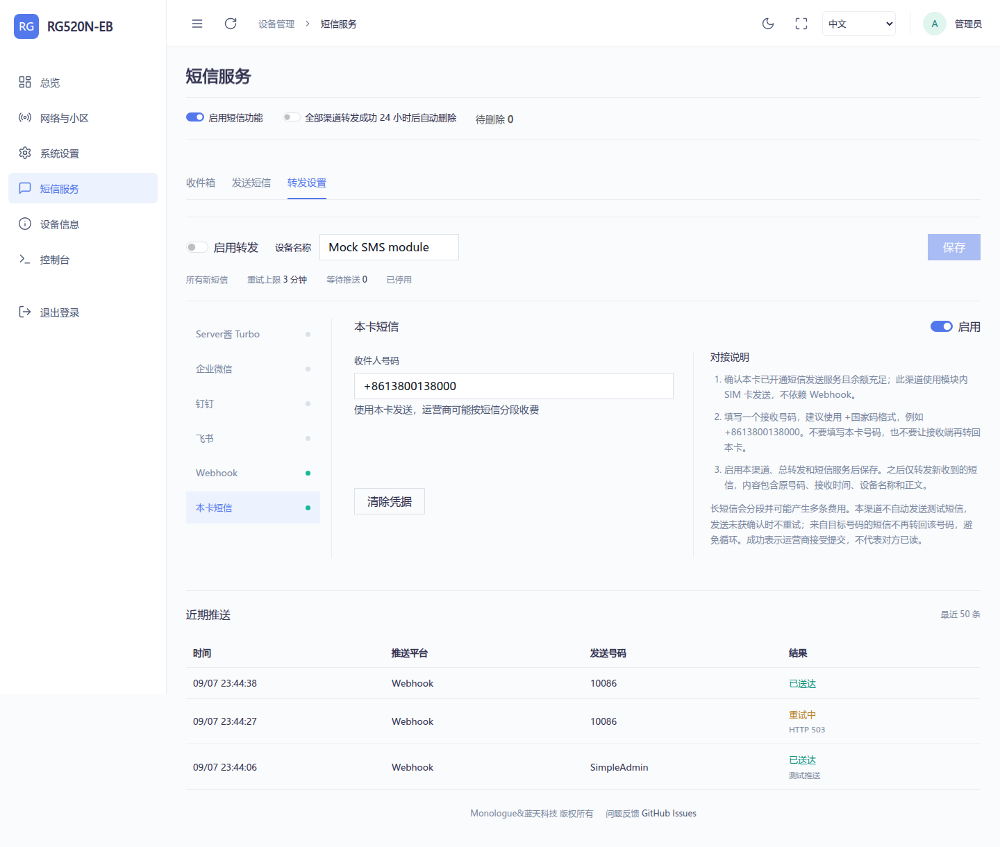

# 短信转发与持久化锁频

适用于 Rust 0.2.5、Windows 工具 1.3.1。

## 短信服务

侧栏仅保留一个“短信服务”入口。顶部为短信总开关、转发成功 24 小时后删除选项和待删除数量，下方按收件箱、发送短信、转发设置切换。旧的 #forwarding 地址仍可跳转到转发设置。



每个渠道的表单旁都有独立对接说明，提供配置步骤、认证要求和失败排查；手机上说明移至表单下方。支持中文、英语、俄语、阿拉伯语。

| 渠道 | 配置 |
| --- | --- |
| Server酱 Turbo | SCT 开头的 SendKey |
| 企业微信 | 群机器人 Webhook，保留 key 参数 |
| 钉钉 | 群机器人 Webhook，按机器人设置填写加签密钥；关键词可使用 SMS |
| 飞书 | 自定义群机器人 Webhook，按机器人设置填写签名密钥 |
| Webhook | HTTP/HTTPS 接收地址、可选完整 Authorization 值；接收 POST JSON 并返回 2xx |
| 本卡短信 | 一个接收号码，建议使用 +国家码格式；使用模块中的 SIM 卡发送 |

旧版本的五个渠道在读取时兼容升级，不清空已保存凭据，也不因升级读取而写入 NAND。短信总开关控制收件箱、手动发送、转发与自动删除。后台转发持续运行，网页只在相应页签可见时轮询界面状态。

### 本卡短信

启用渠道并填写目标号码，打开总转发和短信服务后保存。新收到的短信会以设备名称、原发送号码、接收时间、完整正文组成消息，通过本卡发出。长短信按 PDU 分段；运营商可能按多条短信计费。

此渠道没有测试推送按钮。发送未获确认时不自动重试，避免超时后实际已提交造成重复发送；已提交的分段不能撤回。关闭短信服务或更改转发配置时，会在当前发送事务结束后取消剩余分段。来自目标号码的短信不转回目标号码，避免直接循环；不要填写本卡号码，也不要让其他设备转回本卡。

成功表示全部分段得到模块的提交确认，不代表收件人已读。只有全部启用渠道成功，才会安排可选的 24 小时后删除。网络推送渠道保留最多 3 分钟重试；本卡未确认发送不重试。重启后首次读取将收件箱作为基线，不补发已有短信。

### 自定义 Webhook

请求使用 POST application/json，示例：

```json
{"event":"sms.received","id":"message-id","device":"RM520N-EU","sender":"10086","received_at":"26/09/07,12:00:00+32","text":"message part","part":1,"parts":1}
```

请求头 Idempotency-Key 为消息 ID 与分段编号组合，接收端应据此去重。长短信按 id、part、parts 合并。不跟随重定向；返回 2xx 即视为成功，连接失败、408、429、5xx 最多重试 3 分钟。

## 小区锁定

“网络与小区”的小区锁定区域新增生效方式，适用于手动填写和扫描选中的 LTE/NR5G-SA 小区，即 AT+QNWLOCK 功能。NR5G-SA 每次锁定一个小区；PCI=0 是有效参数。频段偏好列表仍使用原来的 QNWPREFCFG 配置方式。

- 临时锁频：只对当前模块运行生效，不建立开机恢复规则；替换同制式持久化锁频时清除旧的开机恢复规则。
- 持久化锁频：保存校验后的数值参数，在应用启动、AT 初始化等待结束后恢复。
- 三分钟回退：可选，仅对持久化锁频生效。每次应用或开机恢复后开始计时，查询模块 QMAP WWAN 的有效 IPv4/IPv6 数据会话，不以 DNS 或某个 Ping 目标为依据。锁定后先预留 15 秒稳定时间，再判断成功。

三分钟仍未拨号成功时，先停用该规则的开机恢复，再发送解锁指令。保留参数以供手动重新启用；下一次启动不会再自动尝试。拨号成功则结束本次守护，保持锁频；之后普通网络断开不会自动取消。回退指令失败会显示错误并重试。

配置写入沿用挂载 rw、原子写入并同步、恢复 ro 的流程，相同内容不重复写入。临时锁频及守护状态保存在内存；没有待观察规则时守护任务休眠，不轮询 AT。卸载会移除开机恢复文件。

## 验证

63 项 Rust 测试及 Clippy 检查通过，覆盖旧配置兼容、短信分段、发送未确认不重试、循环阻止、临时不落盘、持久化恢复、PCI=0、三分钟超时停用、拨号成功保留、回退失败重试与接口权限。浏览器检查四种语言、四种宽度、六个渠道教程、页签互斥、短信开关、网络重试去重，以及持久化锁频的保存和取消。

短信发送仅使用模拟 AT 测试，没有在真机发送短信。实际无线锁频、运营商短信提交与实际断网恢复仍需在允许对应操作的设备上验证。

RM520N-EU 的 /tmp（tmpfs）隔离实例使用最终 ARM 0.2.5 产物和 --mock 模式，完整等待三分钟，实测第 181 秒触发回退并保存 enabled=false；重启该模拟进程后规则仍停用、参数保留。结束后清理临时程序、配置与 ADB 转发，未更改生产服务或真实无线配置。最终 EXE 通过启动自检和内置资源验证，离线 ZIP 与 SHA-256 校验通过，Linux 安装逻辑 29 项检查通过。
